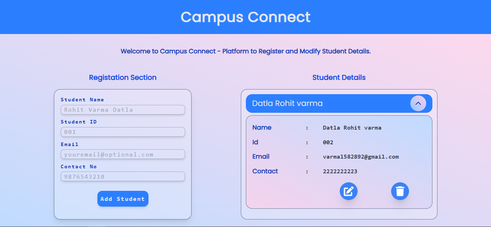

Here's a detailed and professional README template customized for your **Campus Connect** project:  

---

```markdown
# 🌐 Campus Connect

A sleek and professional web application designed for managing student data seamlessly. Built with modern web technologies and an intuitive user interface, Campus Connect allows administrators to efficiently register, edit, and manage student information.

---

## 🚀 Features

- 🔄 **Student Management:** Register, edit, and delete student profiles effortlessly.  
- 🎨 **Modern UI:** Clean and responsive design using **Tailwind CSS** for a seamless user experience.  
- 📄 **Form Handling:** Smooth form submissions with validation.  
- ⚡ **Dynamic UI Updates:** Real-time updates to student lists without page reloads.  
- 🧹 **Cancel Edit Option:** Restore original student data if edit mode is canceled.  
- 💾 **LocalStorage Integration:** Persistent storage for student records between sessions.  

---

## 🛠️ Tech Stack

- **Frontend:** HTML5 
- **Styling:** Tailwind CSS  
- **Backend:** Plain JS 
- **Storage:** Browser LocalStorage  

---

## 📸 Screenshots



---

## 🧩 Installation & Setup

### Prerequisites

- [Node.js](https://nodejs.org/) installed

### Steps

1. Clone the repository:
   ```bash
   git clone https://github.com/visaal1582892/campus-connect
   ```
2. Navigate to the project directory:
   ```bash
   cd campus-connect
   ```
3. Install dependencies:
   ```bash
   npm install
   ```
4. Start the development server:
   ```bash
   npm run dev
   ```

---

## 💻 Usage

1. Open the app in your browser at [http://localhost:3000](http://localhost:3000).  
2. Use the **Add Student** form to register new students.  
3. Click the **Edit** button to modify student details.  
4. Use the **Cancel Edit** option to revert changes during edits.  
5. Reload the page to test persistent storage using LocalStorage.  

---

## 🧪 Testing Instructions

1. **Functionality Test:** Verify form submissions and dynamic student list updates.  
2. **Local Storage:** Ensure student data persists after page reloads.  
3. **Cancel Edit:** Check if the original student details are restored after canceling edits.  

---

## 🌱 Future Enhancements

- ✅ **Backend Integration:** Add a secure Node.js API with database storage.  
- 📈 **Analytics Dashboard:** Visualize student data trends.  
- 🔐 **User Authentication:** Implement secure user login and session management.  
- 🎨 **Dark Mode:** Add light/dark theme toggle for better accessibility.  

---

## 📧 Contact

If you have any questions or feedback, feel free to reach out:

- **GitHub:** [visaal1582892](https://github.com/visaal1582892)
- **Email:** visaal1582892@gmail.com
```

---